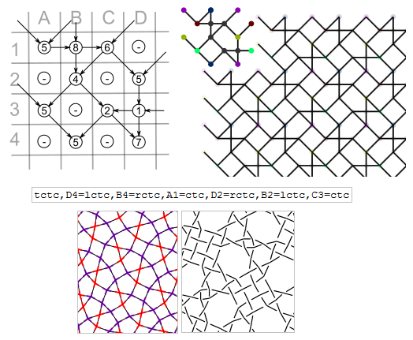

Choose Stitches
===============

- [Form fields](#Form-fields)
- [Stitch definitions](#stitch-definitions)
- [Assign stitches](#assign-stitches)
- [An Example](#an-example)

This page is about choosing stitches for a pair diagram and its corresponding thread diagram.
Different pages use different form fields to choose stitches.

Form fields
-----------

* The [main] page has one text field to define all stitches of a pattern.
  Hover with the cursor over stitches in the pair diagram
  and your browser should show a tool tip with
  an id and the stitch currently assigned to the id.
* The [stitches] page breaks the text field down into one field per stitch.
  A cheat-sheet provides a visual representation for some less trivial stitches.
  The page assembles the content for the first stitch field of the main page.
  The page works only for two patterns and a limited set of dimensions.

Stitch definitions
------------------

The definition of a stitch consists of a sequence  of the characters
`c`, `t`, `l`, `r` for cross, twist, left-twist and right-twist. 
A stitch requires at least a cross, violating this requirement would implicitly change the pair diagram.
Invalid characters are ignored.

You can try a `p` for a pin, but that rarely works as desired,
see issue [#51] for the technical details.

Assign stitches
---------------

The form fields for stitches on the main page expect defaults and/or assignments. For example `A1=ctc` assigns a plain cloth stitch to id A1 which represents the upper left stitch of the pattern.
No spaces are allowed around the equal sign between the id and stitch definition.

If a form field starts with a stitch definition, it is used as default.
When a thread diagrams is used as pair diagram, you can use the keywords `cross` and `twist` as id's for defaults.

An Example
----------

The image below shows screen shot snippets of a pattern and its stitches.

* _Top left:_ the definition of a pattern created by one of the example page.
  The digits inside the circles determine the configuration of arrows arriving at that position. 
  The rows and columns determine the id's assigned to stitches.
  For example the top-left (5) gets id A1. Well, that's the theory.
  Under circumstance the id's in a row of stitches may start somewhere halfway the matrix
  and the stitches wander a little away from their matrix position,
  see issue [#96].
* _Top right:_ how the pattern definition looks like when repeated. The colored dots are explained on the "reshape" pages.
* _Bottom:_ the diagrams generated with the chosen stitches.
  When hovering with your mouse over a stitch (in a generated pattern, not the screenshot above), your browser is supposed to show the id and instructions of a stitch.

[stitches]: /GroundForge/stitches.html
[main]: /GroundForge/
[assemble]: /GroundForge/help/Reversed-engineering-of-patterns
[#51]: https://github.com/d-bl/GroundForge/issues/51
[#96]: https://github.com/d-bl/GroundForge/issues/96
