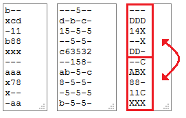

The dimensions for the prototype diagram has some consequences
you may not expect when not giving it any thought.

Large sizes
-----------
Note that a large patch size makes a diagram slower to render.
On slow devices like tablets and phones that might give
the impression that links to pages with a large patch size
don't work at all or block the device.
So create links with patch sizes just large enough to recognize the pattern,
visitors can easily increment the size.

When you specify a too small patch, (or a link with no dimensions)
the size will be automatically increased to contain at least one tile.

Right foot sides
---------------
When a diagram has a foot side on the right,
it will usually match only for every so many columns.
Anyway you will have to reassign the stitches.

If you want another number, go to the "define a repeat" section:
rotating the rows in the right field might help but you might need more changes.
For example for this [pattern](/GroundForge/tiles?patchWidth=13&patchHeight=20&g1=ctct&a1=ctcttl&s2=ctcttr&r2=ctcrr&q2=ctc&h2=ct&f2=ct&d2=ct&c2=ctc&b2=ctc&r3=ctc&q3=ctcl&i3=ctct&g3=ctc&e3=ctct&d3=ct&c3=ctc&b3=ctcll&h4=ctc&f4=ctc&c4=ctc&b4=ctc&a4=ctcttl&r5=ctcrr&q5=ctc&i5=ctc&h5=ctc&g5=ctc&f5=ctc&e5=ctc&d5=ct&s6=ctcttr&h6=ctc&g6=ctc&f6=ctc&r7=ctc&q7=ctcl&i7=ctcr&g7=ctc&e7=ctcl&d7=ct&c7=ctc&b7=ctcll&a7=ctcttl&r8=ctcrr&q8=ctc&h8=ctcr&f8=ctcl&d8=ct&c8=ctc&b8=ctc&s9=ctcttr&r9=ctc&q9=ctcl&i9=ctct&g9=ctct&e9=ctct&h10=ct&f10=ct&d10=ct&c10=ctc&b10=ctcll&footside=b--,xcd,-11,b88,xxx,---,aaa,x78,x--,-aa&tile=---5--,d-b-c-,15-5-5,--5-5-,c63532,--158-,ab-5-c,8-5-5-,-5-5-5,b-5-5-&headside=---,DDD,14X,--X,DD-,--C,ABX,88-,11C,XXX&footsideStitch=ctct&tileStitch=ctc&headsideStitch=ctct&shiftColsSW=0&shiftRowsSW=10&shiftColsSE=6&shiftRowsSE=5)
you would have to change as shown below when switching
between an odd and even number of spider columns. 
Other widths will match with neither of the variations.

