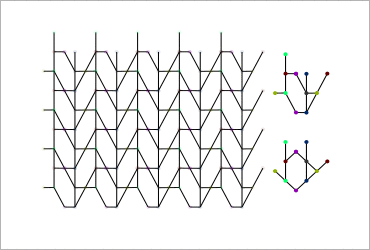
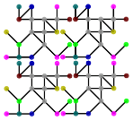
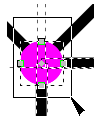

Reshape Patterns
================

  * [Introduction](#introduction)
  * [Make variations in general terms](#make-variations-in-general-terms)
  * [Tried Editors](#tried-editors)
  * [Step 3 in small steps](#step-3-in-small-steps)
  * [Finish up](#finish-up)

Introduction
------------

The animation below moves all intersections in the diagram that correspond with a dot in the top right repeat next to the diagram.
Dots with the same color should move together.
Occasionally more dots are moved together to preserve symmetry.

The animation shows some of these [patterns]. For other variants, the figure with colored dots would need to span multiple repeats to allow a transformation. 

[patterns]: /GroundForge/sheet.html?patch=B-C-,---5,C-B-,-5--;checker&patch=-4-7,5---,-C-B,3158;bricks&patch=5-O-E-,-E-5-O,5-O-E-;bricks&patch=158-,---5,C-B-;checker&patch=8-76,124-;checker&patch=5831,-4-7;checker&patch=68,-4;checker&patch=6868,-4-4,6868,-4-4;checker

In some cases it may be relatively easy to see how one pattern is reshaped in another one. For example in the first row below, the hexagon of the first variant is reshaped in to a brick for the second variant and the center of the bow-tie in the second variant is lowered for the third variant. For the second row it is harder to see. Applying the same color to shapes surrounded with the same number of line segments can help to identify the transition. Note that an edge of a shape may span multiple line segments.

Make variations in general terms
--------------------------------

Features and exact procedures may vary between SVG editors. The least elaborate method in a nutshell:

1. Follow the download link on the page with the [sources][patterns] of the animation. Open the file with the editor of your choice.  
  More patterns are available through the `vari` links on the [Tesselace-Index](Tesselace-Index) and some other catalogues of patterns.
2. If the diagrams are rendered as on the web page, you most likely won't need this step.  
  Provided the isolated dotted repeat is rendered properly, you can reconstruct the rest of the patch by making clones (=/= copies!) of this group of objects. The colored dots are guides to seam the copied repeats together. The following image shows four repeats almost in place. Of course the dots should snap exactly on top of one another.  There may be multiple dots on a single spot, you may want to delete these duplicates in advance. The original repeat must be a group before cloning.  
  
3. You are free to rearrange and ungroup the patterns, but don't ungroup individual repeats: it would break the links between clones and originals.   
  The close up below shows control points of multiple selected objects: a dot and four line ends at the center of the dot. When moving these control points for all dots of the same color together, the corresponding points in the patch should move along and the diagram should remain valid. The grey dots can move individually.  
  

Workaround for step 3:
* Assign new unique colors to the grey dots on the original repeat to make corresponding dot easier to recognize.
* Create a new patch with 2x2 or 3x3 copies of the original repeat, as in step 2. A smaller number makes it harder to get an impression of the manipulated pattern, a larger number makes the next task more elaborate.
* Select corresponding dots one by one through the whole patch.

Tried Editors
-------------

Some tried [SVG editor]s (they might have been improved, check for a free trial period):
* Lace8 and Knipling (💰, not on Mac) don't support SVG and fail at step 1.
* InkScape (free, needs crutches on a Mac) can skip step 2.
* Affinity Designer (💰, Mac and Windows) probably won't need step 2, step 3 not yet tried.
* InkPad (free, iPad) doesn't need step 2, version 1.6 requires the workaround for  step 3.
* CorelDRAW (Home and Student Suite 💰, Windows) former version x8 requires step 2.
* Adobe Illustrator  (💰💰, subscription) v2015-3.1 requires the workaround for step 3.

Step 3 in small steps
---------------------

As tried for InkScape v0.91, works probably very similar for Affinity Designer.

* Start with object mode.
  * Double-click the pattern of your choice to enter the group of objects.
  * Double-click the isolated repeat with coloured dots to enter the group of objects.
  * Select all the objects in the group of the repeat.
* Switch to node mode.
  * Select a dot by dragging a square around it. This way the end of the adjacent lines are also selected and will move along with the dot.
  * Less than four adjacent lines on the selected dot? Hold down the shift key when selecting the second or even third dot of the same colour.
  * Dragging the nodes with the mouse is dangurous as you easily loose your selection. Nudge the selection around with arrow keys. Five times an arrow key in InkScape is a full grid position. One time shift+arrow is two grid positions.

Finish up
---------

When done with adjusting the pattern you might do all kind of other things with it. Such as scaling to match your thread width, fill a shape in your design, [bend] it to make a fan, add columns or rows to the patch or whatever. The editor of your choice will have its own tutorials and manuals for these tasks. 

Veronika Irvine wrote some lace related tutorials for InkScape on a [blog].

[SVG editor]: https://en.wikipedia.org/wiki/Comparison_of_vector_graphics_editors#File_format_support

[blog]: https://tesselace.com/blog/

[bend]: http://tavmjong.free.fr/INKSCAPE/MANUAL/html/Paths-LivePathEffects-BendTool.html
