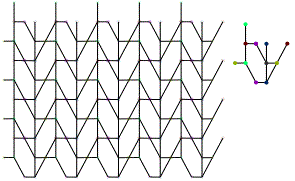
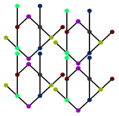

Reshape Patterns
================

  * [Introduction](#introduction)
  * [Make variations in general terms](#make-variations-in-general-terms)
  * [Evaluated Editors](#evaluated-editors)
  * [Step 3 for InkScape](#step-3-for-inkscape)
  * [Insert or transform into a design](#insert-or-transform-into-a-design)

Introduction
------------

The animation shows in short how to manipulate a pattern with an editor.

 

In the middle a single repeat that leads the dance of the pattern. On the right four static repeats that almost snapped together: dots with the same color help to sew the repeats together. These dots should sit on top of one another. The dance leader should move dots with the same colors together. It can move more at once, for example to preserve symmetry.

The animation shows some of these [patterns]. For the other variants, corresponding intersections of every other repeat should be moved together. In other words: the isolated repeat that leads the dance should span multiple repeats.

[patterns]: ../sheet.html?patch=B-C-,---5,C-B-,-5--;checker&patch=-4-7,5---,-C-B,3158;bricks&patch=5-O-E-,-E-5-O,5-O-E-;bricks&patch=158-,---5,C-B-;checker&patch=8-76,124-;checker&patch=5831,-4-7;checker&patch=68,-4;checker&patch=6868,-4-4,6868,-4-4;checker

In some cases it may be relatively easy to see how one pattern is reshaped in another one. For example in the first row below, the hexagon of the first variant is reshaped in to a brick for the second variant and the center of the bow-tie in the second variant is lowered for the third variant. For the second row it is harder to see. Applying the same color to shapes surrounded with the same number of line segments can help to identify the transition. Note that an edge of a shape may span multiple line segments.

Make variations in general terms
--------------------------------

Features and exact procedures may vary between SVG editors. The least elaborate method in a nutshell:

1. Follow the download link on the page with the [sources][patterns] of the animation. Open the file with the editor of your choice.  
  More patterns are available through the `vari` links on the [Tesselace-Index](TesseLace-Index) and some other catalogues of patterns.
2. Depending on the editor you may need to rebuild the pattern from the isolated repeat. Otherwise the pattern won't follow the dance of the leader as in the animation at the start of this page.
3. The close up below shows control points of multiple selected objects: a dot and four line ends at the center of the dot. When moving these control points for all dots of the same color together, the corresponding points in the patch should move along and the diagram should remain valid. The grey dots can move individually.  
  
  
Variations for step 3:

Your editor might not have facilities that link the pattern with the repeat that leads the dance,
or you want more flexibillity for an erratic pattern or metamorphose.
In those cases you should rebuild the pattern from the isolated repeatas in step 2.
First assign your own unique colors (or shapes such as squares or open circles) to the grey dots,
and probably limit the dimesions to 2x2 or 3x3 repeats.
A larger number is more elaborate, with a smaller number it is harder to see the pattern.
Then you can select dots with the same color through the whole pattern,
as far as aplicable for your purpose.

Evaluated Editors
-----------------

The procedure above is tried for just some of the available [SVG editor]s. They might have been improved since then, check for a free trial period to convince yourself you can work with it:
* Lace8 and Knipling (💰, not on Mac)  
  these don't understand the downloads at all.
* InkScape (free, needs crutches on a Mac)  
  won't need step 2, see below for details.
* Affinity Designer (💰, Mac, iPad and Windows)   
  does need step 2, see below below for details.
* CorelDRAW (💰💰, Home and Student Suite 💰, Windows)    
  use `clone` from the edit menu for step 2.
* InkPad (free, iPad)  
  version 1.6 has no facilities to make the pattern follow the leader of the dance.
* Adobe Illustrator  (💰💰, subscription)  
  not tried. Perhaps these [instructions] can be of use for step 2. Start at about 5:50. From another: "Any changes made while in `pattern editing mode` will be applied to the `swatch` upon exit".

[graphicheck]: https://graphicheck.com/blog/Affinity-Designer-Background-Patterns-Mock-up-Template
[instructions]: https://www.youtube.com/watch?v=aQM3RLWN0vQ

Step 3 for InkScape
-------------------

* Start with object mode.
  * Double-click the pattern of your choice to enter the group of objects.
  * Double-click the isolated repeat with coloured dots to enter the group of objects.
  * Select all the objects in the group of the repeat.
* Switch to node mode.
  * Select a dot by dragging a square around it. Because all objects were selected in advance, the ends of the adjacent lines are also selected and will move along with the dot.
  * Less than four adjacent lines on the selected dot? Hold down the shift key when selecting the second or even third dot of the same colour.
  * Dragging the nodes with the mouse is dangerous as you easily loose your selection. Nudge the selection around with arrow keys. Five times an arrow key in InkScape is a full grid position. One time shift+arrow is two grid positions.

Step 2 and 3 with affinity designer
-----------------------------------

Some patterns may have more variants than fit into the visible area,
select everything and move the patterns around to find the repeat you want to use.

Three half minute video's show a possible approach.
* [join](images/join-lines.mp4) lines to work around a [bug](https://forum.affinity.serif.com/index.php?/topic/69189-not-all-nodes-in-an-area-are-selected/)
* [duplicate](dup-symbols.mp4) the repeat using symbols, moving them with arrow keys while holding down shift
* [move](images/move-dots.mp4) dots with the same color. Sorry, dark blue is hard to tell from black.

Insert or transform into a design
---------------------------------

When done with adjusting the pattern you might do all kind of other things with it. Such as scaling to match your thread width, [fill] a shape in your design, [bend] it to make a fan, add columns or rows to the patch or whatever. The editor of your choice will have its own tutorials and manuals for these tasks. 

[SVG editor]: https://en.wikipedia.org/wiki/Comparison_of_vector_graphics_editors#File_format_support

[fill]: https://tesselace.com/2017/11/08/filling-a-shape-with-a-lace-ground/

[bend]: http://tavmjong.free.fr/INKSCAPE/MANUAL/html/Paths-LivePathEffects-BendTool.html
