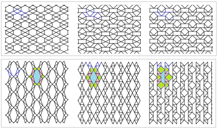

Reshape Patterns
================

The animation below shows how dragging all dots of a color simultaneously keeps the diagram valid.
Occasionally multiple colors are moved together to preserve symmetry.
The animation uses some of [these](/GroundForge/sheet.html?patch=5831%20-4-7;checker&patch=68%20-4;checker&patch=B-C-%20---5%20C-B-%20-5--;checker&patch=-4-7%205---%20-C-B%203158;bricks&patch=5-O-E-%20-E-5-O%205-O-E-;bricks) TesseLace patterns.
For variants not in the animation, the figure with colored dots would need to span a larger section of the pattern to allow a transformation. 

In some cases it may be relatively easy to see how one pattern is reshaped in another one. For example in the first row below the hexagon of the first variant is reshaped in to a brick for the second variant and the center of the bow-tie in the second variant is lowered for the third variant. For the second row it is harder to see. Applying the same color to shapes surrounded with the same number of line segments can help to identify the transition. Note that an edge of a shape may span multiple line segments.

[GroundForge]: /GroundForge/
[patterns]: https://github.com/d-bl/GroundForge/tree/gh-pages/patterns

The manipulated screenshot above reflects a manipulated pattern sheet. The generated sheets only use full grid positions. Other sheets may come with just a single pattern that does not look at all like the colour coded pair diagram. To create a regular patch that does look like the pair diagram (or any other shape you might prefer) you would have to do the reshaping by yourself by nudging the position of intersections.

The procedure
-------------

Depending on the features provided by your [SVG editor] you can use different methods to customize a pattern.
The procedure using clones (listed in the side bar of the wiki) is less elaborate but is supported by less editors, the procedure using copies is more flexible, allowing for example metamorphoses from one shape into another. 

[SVG editor]: https://en.wikipedia.org/wiki/Comparison_of_vector_graphics_editors#File_format_support

Finish up
---------

When done with adjusting the pattern you might do all kind of other things with it. Such as scaling to match your thread width, fill a shape in your design, [bend] it to make a fan, add columns or rows to the patch or whatever. The editor of your choice will have its own tutorials and manuals for these tasks. 

[bend]: http://tavmjong.free.fr/INKSCAPE/MANUAL/html/Paths-LivePathEffects-BendTool.html
