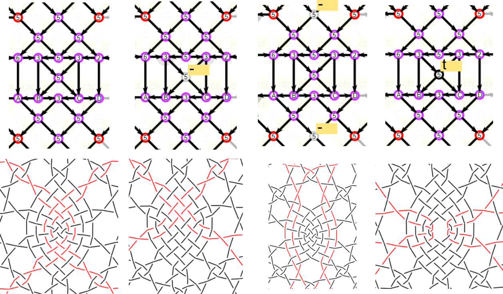

Help Intro
==========

Experiment with Bobbin Lace Grounds
-----------------------------------

Varying stitches and reshaping a downloadable diagram may render a myriad of variations for a single pattern.
Experiment and play around with the hundredths of provided patterns or add your own.
Even when reinventing wheels, your own discoveries can bring great joy. 

The [tiles](../tiles) page generates diagrams and guides you through most important first steps.
Help pages in the side bar explain more in-depth subjects.
The following section discusses a versatile traditional pattern.
A small strip with foot sides turns the pattern in a Milanese braid with a twist. 

<a name="BK-31"/>

"Binche Kompakt" feature 31
---------------------------

Feature 31 in the [DKV pattern] "Binche Kompakt" was previously published in "Kant" issue 2002/2.
Anne-Marie Verbeke-Billiet puts four variations of sometimes lost Binche grounds in historical context.

Nowhere a strong close up for the challenging ground.
That asked for a thread diagram generated out of a doable pair diagram.

Dropping stitches in the interactive pattern ([with] and [without] foot sides, slow on tablets an phones)
and using turning stitches can render the variations below.
Note the one (center) or two (top and bottom) grey symbols in the upper diagrams,
they represent the dropped stitches.
[Below](nrs) an educated guess on the numbers of possible variations.

[without]: https://d-bl.github.io/GroundForge/tiles?patchWidth=19&patchHeight=22&d1=ctct&e2=ct&c2=ct&a2=lct&f3=ctct&d3=ctc&b3=ctct&a3=ct&e4=ctc&c4=ctc&f5=ctc&e5=ctc&d5=ctc&c5=ctc&b5=ctc&a5=ct&e6=ctc&d6=ctc&c6=ctc&f7=ctc&d7=ctc&b7=ctc&a7=rct&e8=ctc&c8=ctc&a8=ct&f9=lctct&d9=ctc&b9=rctct&e10=lct&c10=rct&a10=ct&tile=---5--,d-b-c-,15-5-5,--5-5-,c63532,--158-,ab-5-c,8-5-5-,-5-5-5,b-5-5-&footsideStitch=ctctt&tileStitch=ctc&headsideStitch=ctctt&shiftColsSW=0&shiftRowsSW=10&shiftColsSE=6&shiftRowsSE=5
[with]: https://d-bl.github.io/GroundForge/tiles?patchWidth=7&patchHeight=22&k1=ctcttr&f1=ctct&a1=ctcttl&j2=ctc&g2=ct&e2=ct&c2=ct&b2=ctc&j3=ctcrr&h3=ctct&f3=ctc&d3=ctct&c3=ct&b3=ctcll&k4=ctcttr&j4=ctc&g4=ctc&e4=ctc&b4=ctc&a4=ctcttl&h5=ctc&g5=ctc&f5=ctc&e5=ctc&d5=ctc&c5=ct&g6=ctc&f6=ctc&e6=ctc&k7=ctcttr&j7=ctcrr&h7=ctcr&f7=ctc&d7=ctcl&c7=ct&b7=ctcll&a7=ctcttl&j8=ctc&g8=ctcr&e8=ctcl&c8=ct&b8=ctc&h9=ctct&f9=ctct&d9=ctct&j10=ctcrr&g10=ct&e10=ct&c10=ct&b10=ctcll&footside=b-,xc,-1,b8,xx,--,aa,x7,x-,-a&tile=---5--,d-b-c-,15-5-5,--5-5-,c63532,--158-,ab-5-c,8-5-5-,-5-5-5,b-5-5-&headside=-C,BX,8-,1C,xX,--,DD,4X,-X,D-&footsideStitch=ctct&tileStitch=ctc&headsideStitch=ctct&shiftColsSW=0&shiftRowsSW=10&shiftColsSE=6&shiftRowsSE=5
[DKV pattern]: http://www.deutscher-kloeppelverband.de/index.php/component/jshopping/product/view/4/47?Itemid=242

### Methods to drop stitches

The screen shots above dropped stitches by replacing `ctc` with `-`.
This can have unexpected results such as more stitches disappearing
and/or the algorithm switching pairs before making the stitch.
The latter effect causes weird thread diagrams.
It might be better to go to the advanced section.
Apply the blue changes below for the second and last variant above.
Apply the red changes for the third variant.

<a name="nrs"/>

### Number of variations

The hard copy catalogue "_Viele gute Gründe_" by Ulricke Voelcker Löhr has 28 combinations
of stitches for the second variant (5,6,17-23,26-36,93,103,132,139,140 in the B3 series),
3 each for the two last variants (12-14, 106-108) and 7 for the first (25,71-76).
That adds up to 41. Multiplied with the first 22 of B4.2 (that surrounds the six-pair element)
gives 902 documented thread diagrams for this base pattern.

The stitch combinations for the second variant might be pretty complete
for symmetrical options and traditional stitches.
The first variant has more stitches than the second
so it must also allow more stitch combinations.
The third and last variant also must allow for more than three stitch combinations each.
Only sample 33 and 106 of B3 have unorthodox stitches that twist just one pair or none.
Making more use of these stitches or drop more stitches allows even more combinations.
All in all the number of possibilities may well run into the thousands.
