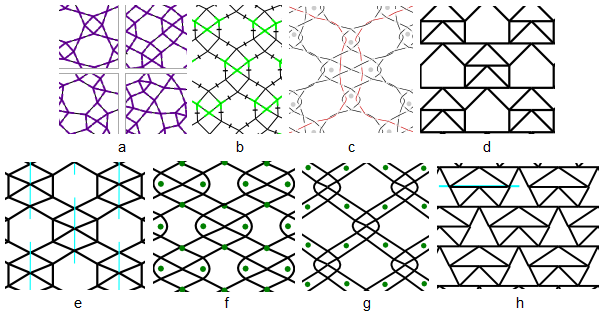
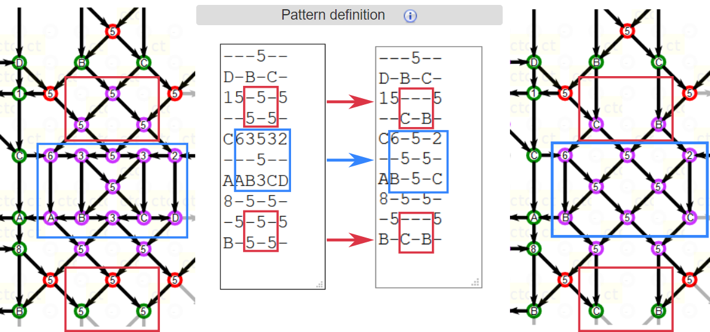

Help Intro
==========

Experiment with Bobbin Lace Grounds
-----------------------------------

Varying stitches and reshaping a downloadable diagram may render a myriad of variations for a single pattern.
Experiment and play around with the provided base patterns or add your own.
Even when reinventing wheels, your own discoveries can bring great joy. 

Approach
--------

Each type of diagram plays its own role while designing bobbin lace grounds. The creative process involves several decisions, each playing a role in an iterative process.
The diagram generator can relief much tedious work that would go into these steps in ink and paper times and reduce (but not eliminate) the trial and error of experimental patches. In short:

Follow the steps on the [tiles] page:
* Select a pattern such as one of the thumbnails in figure `a`.
* Set stitches in the prototype diagram (not shown below) for figure `b` and get `c` as a bonus.
* Apply colors to individual threads in figure `c` to plan contrasting threads (thickness or color) in your work.

Patterns may have two links, one to `GroundForge/tiles` another to `GroundForge/sheet`.
The latter may produce multiple diagrams like figure `d` and a singled-out repeat. 
Download and [customize] it with a third party editor
into `e-h` or whatever your fancy.

[customize]: Reshape-Patterns
[tiles]: ../tiles

The diagrams in figure `b` and `c` just provide instructions to create a patch of lace
but don't inform you about the positions of the pins,
like the London Tube maps inform you about destinations and connections
but not about geographic locations or travel time.

The blue lines in figure `e` and `h` show the lines of nudging pins
from the downloaded figure `d`.
Figure `f` and `g` rounded a few corners and added pins.

<a name="BK-31"/>

"Binche Kompakt" feature 31
---------------------------

Feature 31 in the DKV [pattern] "Binche Kompakt" was previously published in "Kant" issue 2002/2.
Anne-Marie Verbeke-Billiet puts four variations of sometimes lost Binche grounds in historical context.

Nowhere a strong close up for the challenging ground asked for a thread diagram generated out of a doable pair diagram.

The [interactive] pattern (slow on tablet an phones) allows for the variations below by dropping stitches and/or using turning stitches.
Note the one or two grey symbols in the upper diagrams, they represent the dropped stitches.

[interactive]: https://d-bl.github.io/GroundForge/tiles?patchWidth=19&patchHeight=22&d1=ctct&e2=ct&c2=ct&a2=lct&f3=ctct&d3=ctc&b3=ctct&a3=ct&e4=ctc&c4=ctc&f5=ctc&e5=ctc&d5=ctc&c5=ctc&b5=ctc&a5=ct&e6=ctc&d6=ctc&c6=ctc&f7=ctc&d7=ctc&b7=ctc&a7=rct&e8=ctc&c8=ctc&a8=ct&f9=lctct&d9=ctc&b9=rctct&e10=lct&c10=rct&a10=ct&tile=---5--,d-b-c-,15-5-5,--5-5-,c63532,--158-,ab-5-c,8-5-5-,-5-5-5,b-5-5-&footsideStitch=ctctt&tileStitch=ctc&headsideStitch=ctctt&shiftColsSW=0&shiftRowsSW=10&shiftColsSE=6&shiftRowsSE=5
[pattern]: http://www.deutscher-kloeppelverband.de/index.php/component/jshopping/product/view/4/47?Itemid=242

### Methods to drop stitches

The screen shots above dropped stitches by replacing `ctc` with `-`.
This can have unexpected results such as more stitches disappearing
and/or the algorithm switching pairs before making the stitch.
The latter effect causes weird thread diagrams.
It might be better to go to the advanced section.
Apply the blue changes for the second and last variant.
Apply the red changes for the third variant.

### Number of variations

The hard copy catalogue “Viele gute Gründe” by Ulricke Voelcker Löhr has 28 combinations
of stitches for the second variant (5,6,17-23,26-36,93,103,132,139,140 in the B3 series),
3 each for the two last variants (12-14, 106-108) and 7 for the first (25,71-76).
That adds up to 41. Multiplied with the first 22 of B4.2 (that surrounds the six-pair element)
gives 902 documented thread diagrams for this base pattern.

The stitch combinations for the second variant might be pretty complete
for symmetrical options and traditional stitches.
The first variant has more stitches than the second
so it must also allow more stitch combinations.
The third and last variant also must allow for more than three stitch combinations each.
Only sample 33 and 106 of B3 have unorthodox stitches that twist just one pair,
we can also drop more stitches so the number of possibilities may well run into thousands.