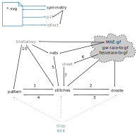

* [Arrow legend](#arrow-legend)
* [Help pages and galleries](#help-pages-and-galleries)
* [Scrolling, small devices and sidebar](#scrolling-small-devices-and-sidebar)
* [Known third party pages/sites](#known-third-party-pagessites)

The banner of each page links to the [home page](https://d-bl.github.io/),
as does the explicit home link in the various sidebars.
This home page gives a descriptive overview of entry points.

The diagram lists page names as they appear in the address bar of your browser.
Grey page names are not on the home page.
The pages depicted in the cloud are prefixed with _d-b.github.io/_.
The other pages are prefixed with _d-b.github.io/GroundForge/_.
The snow mixer (_**mix4snow**_) has a [navigation](/GroundForge-help/snow-mix/#footside-detour-navigation)
section in its own tutorial.

Arrow legend
------------

* black: links
* blue: download/upload alias import/export
* dashed: recovery for third party sites, their pages may link to an obsolete page.
  See also [404](/GroundForge/404)

1. Use the pattern below to experiment with _stitches and threads_.
2. Use the _thread diagram as pair diagram_.
3. Back to original _pair diagram_ (this link may return to the snow mixer).
4. Back to the _pattern definition_.
5. Diagram captions.
6. SVG link per family of patterns.
7. Diagram titles should go to the stitches page but still go to the tiles page.
8. _Tweak footsides_
9. _6 pair snow_
10. The links appear in diagram captions after clicking a letter in the gallery.

Help pages and galleries
------------------------

The pages _**pattern**_, _**stitches**_ and _**droste**_ have a button that can hide/show a help menu.
When the menu is hidden, the links 1-4 are just below this button.

The other pages have a single link or a short story linking to tutorials and/or help pages.
Both types of help pages would clutter the overview.

Help pages and galleries (depicted in the cloud) have a sidebar with links to other help pages respectively pages in the same gallery.
They may also have a table of contents at the top of the page.

Scrolling, small devices and sidebar
------------------------------------

Many devices have a habit of hiding scrollbars. When you don't see a banner, you can scroll up.
Diagrams should have room in the margin to scroll the rest of the page on mobile devices.

We don't have a common footer but please scroll down below the visible diagrams, there might be more.

Smaller devices may not have room for a sidebar. Then the menu moves down to the bottom.
A floating  jumps to that menu.

Known third party pages/sites
-----------------------------

* https://groups.io/g/GroundForge/
* https://groups.io/g/pointfusion/
* https://tesselacedotcom.wordpress.com
* https://gibritte.over-blog.com/search/groundforge/
* https://gibritte2.blogspot.com/search?q=GroundForge
* https://kantelier.wordpress.com (posts may have old links)
* IOLI [challenge 5](https://lacechallenge.internationalorganizationoflace.org/#h.ouc3mhbkvsi5)
* Courses by Veronika Irvine, TAL, ...
* Scientific papers by [Veronika Irvine](https://orcid.org/0000-0002-9455-8712) and [others](https://dl.acm.org/doi/10.1145/3689050.3704957)
* pinterest / facebook / instagram / discord / . . .

